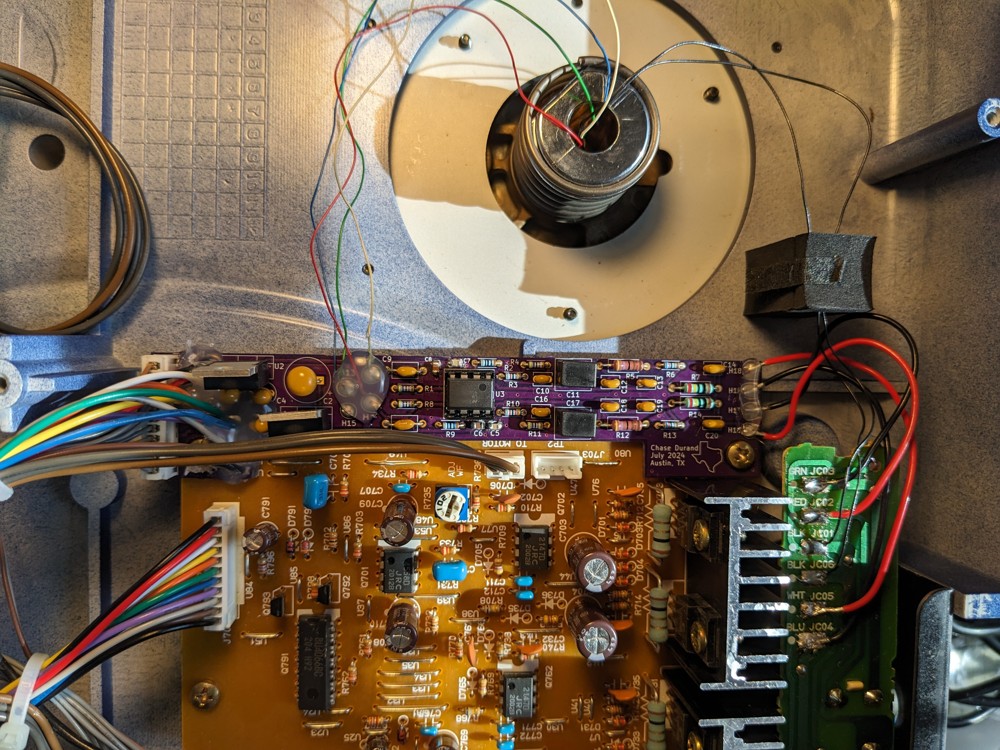
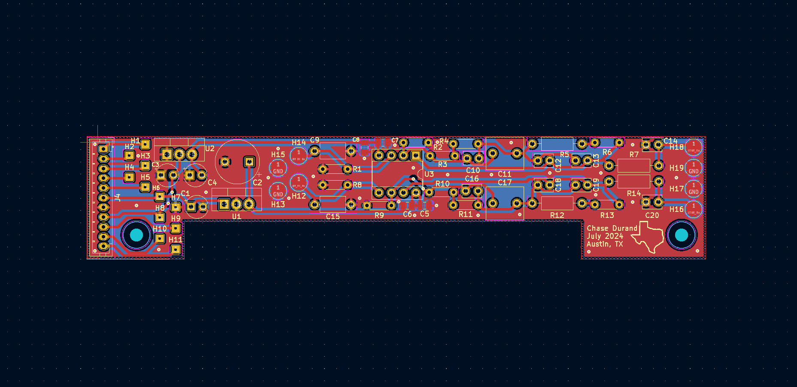
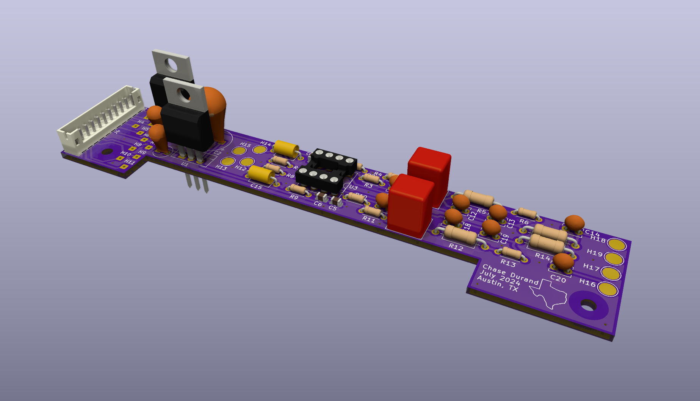

# Vestax-PDX-2000-Phono-Preamp
Integrated phono preamp for Vestax PDX-2000 turntables. Board taps into internal +15V/-15V/GND for power and is hardwired into the audio path. Designed for moving magnet catridges (specifically Shure M44-7 and Ortofon Mix Concorde Mk II).

    

Specs:
* Gain ~42.65dB at 1kHz.
* Loading 47kΩ, 360pF.
* Simulated amplitude within +/-0.05dB of RIAA.
* Actual amplitude within +/-0.5dB of RIAA.
* Left/right channel amplitude within +/-0.22dB.
* Left/right channel phase within +/-0.67°.

    

    

    

