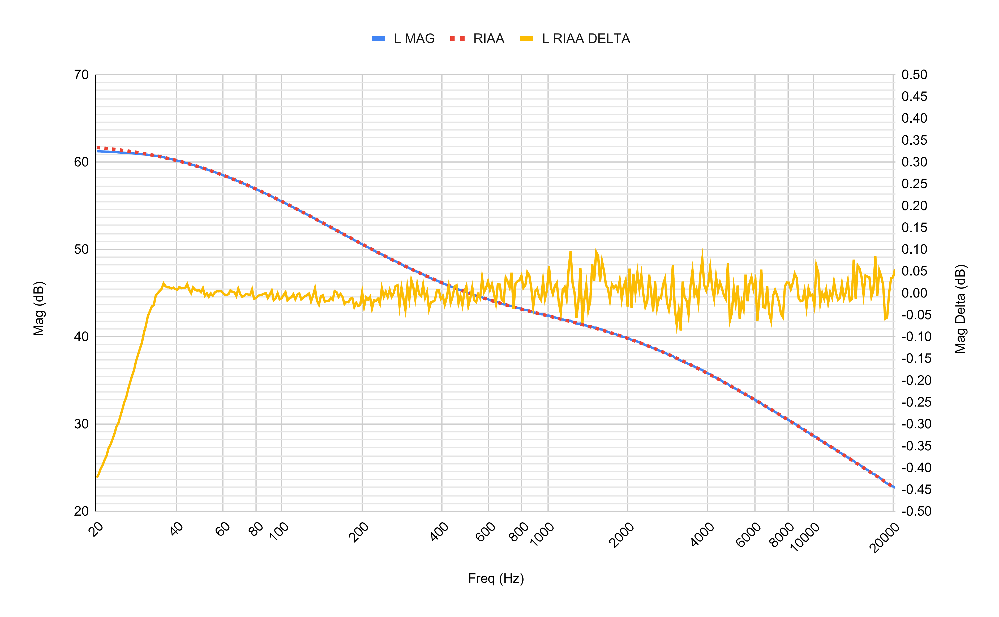

# Vestax-PDX-2000-Phono-Preamp
Integrated phono preamp for Vestax PDX-2000 turntables. Board taps into internal +15V/-15V/GND for power (with 12V regulators for ripple reduction) and is hardwired into the audio path. Designed for moving magnet catridges- specifically Shure M44-7 and Ortofon Mix Concorde Mk II.

    

Specs:
* Gain ~42.7dB at 1kHz.
* Loading 47kΩ, 360pF.
* Simulated amplitude within +/-0.05dB of RIAA.
* Actual amplitude within +/-0.5dB of RIAA.
* Left/right channel amplitude within +/-0.22dB.
* Left/right channel phase within +/-0.67°.

The board uses existing PCB screws on board P100 to mount in the chasis. The existing cable on J704 is re-routed to J4, and new wires and an 11-pin JST connector go to J704. The tonearm wires are routed to the input section of the PCB, and new wires connect the output of the amplifier to the original output PCB and RCA jacks.

    

Overall performance is very good with minimal deviations from RIAA, simulation, and left/right channels. Note that some plots below use a heavily magnified delta on the right axis.

The [LTSpice simulation](spice/) closely follows the RIAA amplitude curve within +/-0.05dB:

    

Simulations with 1% tolerance parts give a max amplitude error of +/-0.15dB:

    

The actual amplitude error is within +/-0.5dB, with the majority being within +/-0.1dB:

    

The frequency response of the left and right channels is closely matched:

    

The phase is very similar to the simulation:

    

The phase response of the left and right channels is closely matched:

    

